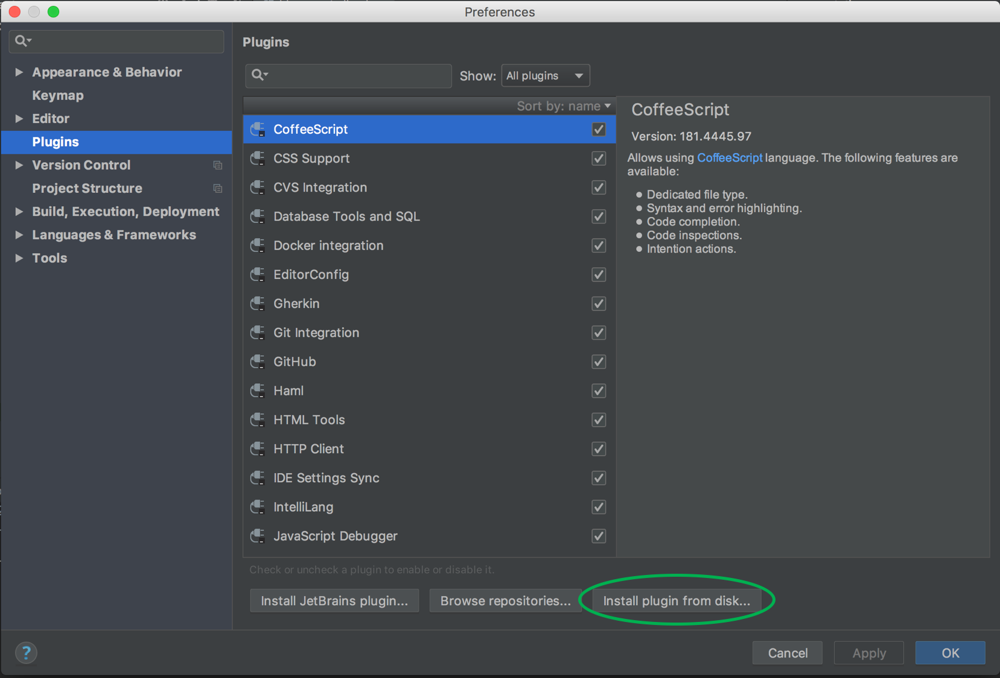
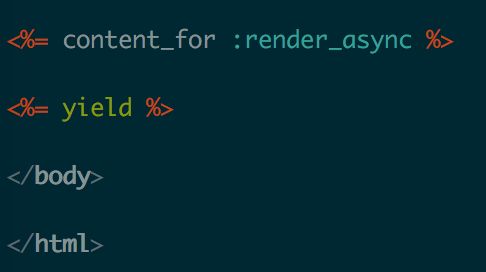
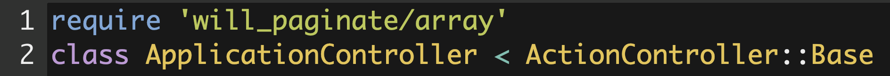

<div class="container" markdown="1">
<div class="row" markdown="1">
<div class="col-md-12" markdown="1">

Below are steps to run Panorama (IDE version) to analyze and improve your own Rails application.


### Download Panorama IDE plugin

1. Download and install [RubyMine](https://www.jetbrains.com/ruby/).

2. Download [Panorama](https://plugins.jetbrains.com/plugin/11503-panorama).

3. Open RubyMine and go to `preference`->`plugin`, then click `Install plugin from disk`, and select the panorama jar file just downloaded.<br/>


4. Open your project with RubyMine.


### Modify your app
Since Panorama changes the webpage layout and monitors then code change, you need to modify your app to enable such functionality.

* Add the following to your Gemfile
```
gem 'will_paginate'
gem 'bootstrap-sass'
gem 'sass-rails'
gem 'render_async'
gem 'react-rails-hot-loader'
gem 'active_record_query_trace'
```
You can also do this by
```
cd panorama-static-analyzer
ruby add_gems.rb path-to-app/
```

* Add the following to `app/assets/javascripts/application.js` or `app/assets/javascripts/application.js.erb` (if such files exist, otherwise create the file):
```
//= require bootstrap-sprockets
//= require react-rails-hot-loader  
//= require_tree ./interact
```

* Create a folder `interact/`:
```
$ mkdir app/assets/javascripts/interact
```

* Add the following to `app/assets/stylesheets/application.scss` (create this file if not exists):
```
@import "bootstrap-sprockets";
@import "bootstrap";
```

* Create new `active_query_trace.rb`:
```
$ touch config/initializer/active_query_trace.rb
```
and add the following to this file:
```
ActiveRecordQueryTrace.enabled = true
ActiveRecordQueryTrace.lines = 0
ActiveRecordQueryTrace.level = :rails
``` 

* Add the following to the body of your view file (e.g., `app/views/layouts/application.html.erb`):
```
<%= content_for :render_async %>
```
For instance,<br/>
<br/>

* Add the following to the head of your application_controller.rb:
```
require 'will_paginate/array'
```
For instance,<br/>
<br/>

* create `calls.txt`<br/>
The tool needs to know all entrance controller actions from your application. It assumes them to be stored in a file called `calls.txt`. You can generate that file by running:
  ```
  $rake routes | tail -n +2 | awk '{ for (i=1;i<=NF;i++) if (match($i, /.#./)) print $i}' | sed -e 's/#/,/g' | sort | uniq
  ```
  in your app, and then copying it to `<APPDIR>/calls.txt`.

### Download Panorama Static Analyzer and install related packages
* Clone the [Panorama Static Analyzer source code](https://github.com/hyperloop-rails) from github.

* The following packages need to be installed in order to run Panorama:
```
$ gem install yard
$ gem install activesupport
$ gem install work_queue
```
### Start Panorama Static Analyer and Panorama IDE plugin
* Before running Panorama, you may first visit a few webpages in the chrome. This will generate a log file, which will be analyzed by Panorama.

* Then go to the panorama folder and run the script to start a thread to monitor the browser activity, and send a request to change the source code if a patch suggestion is granted:
```
$ cd path_to_panorama-static-analyzer
$ ./compute_performance.sh PW-blog /home/blog-app/ BlogsController,index
```
For other applications, replace `PW-blog` with application name, `/home/blog-app/` with the path to the app source, and `BlogsController,index` with the controller action you want to exam.

* In the RubyMine IDE, open the app and turn on the Panorama:<br/>
<br/>

### Read the heatmap and check Panorama's suggested patches
* Refresh the webpage it will look like this:<br/>
<br/>
Lefthand side is a legend shows the "heat", i.e., the cost to generate each element, with cooler color (on the side of scale 0) indicating less time and warmer color indicating more time. By default it shows the static cost, and you can choose other measuring method like using real cost numbers. 

* When you move the cursor to an element and click, it will show patches that Panorama can generate to accelerate the element:<br/>
<br/>
<br/><br/>
Click the patch (e.g., pagination) and you can view the code change:
<br/><br/>
It shows which file it will change, the old code and the new patch code.
If you wish to adopt a patch, click the "AcceptOrNot" on the "Panorama" menu, and the click "ok".

* Panorama will change the application source code if you accept a patch, and then you can see the accelerated webpage:<br/>
<br/>


</div>
</div>
</div>
